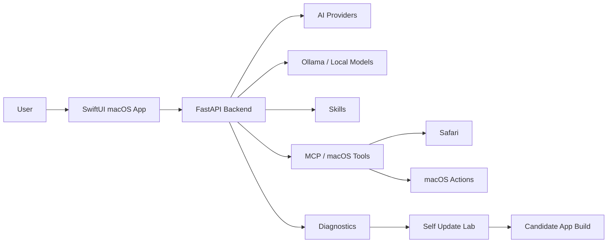

<div align="center">

# Mac Agent OS

### A native macOS AI agent experiment

#### SwiftUI • FastAPI • Ollama • ChatGPT/Codex Bridge • MCP Tools • Skills • Self-Update Lab


**An open experiment to build a powerful, free, community-driven desktop AI agent for macOS.**

</div>

---

## The Idea

Mac Agent OS is an experimental desktop AI assistant for macOS.

The goal is to move beyond a simple chatbot and build an agent that can understand the user’s Mac, use local tools, connect to different AI providers, work with local models, diagnose problems, and eventually help improve itself through a supervised self-update workflow.

This project is early, but the direction is ambitious:

> A local-first macOS AI agent that is useful, extensible, transparent, and shaped by the community.

---

## Why This Project Exists

Most AI assistants are either cloud-only, expensive, closed, or limited to conversation.

Mac Agent OS explores another path:

- a native macOS app
- local models through Ollama
- optional cloud providers
- desktop actions through tools
- skills that can extend behavior
- diagnostics that explain what is working
- a self-update lab for supervised evolution

The dream is to create a desktop AI environment that users and developers can actually shape.

---

## What It Can Do Today

| Capability | Status |
|---|---|
| Native macOS SwiftUI app | Working |
| Local FastAPI backend | Working |
| Bundled backend inside `.app` | Working |
| Ollama local model detection | Working |
| ChatGPT / Codex Bridge | Experimental |
| Provider configuration UI | Experimental |
| MCP / local tools | Experimental |
| Safari and macOS actions | Partial |
| Skills system | Early |
| Diagnostics and logs | Working |
| Self Update Lab | Early |
| French / English interface | Started |

---

## Core Features

- **Native macOS interface** built with SwiftUI
- **Local backend** powered by FastAPI
- **Ollama support** for local models
- **ChatGPT / Codex Bridge** provider mode
- **OpenAI-compatible provider architecture**
- **Hugging Face, Anthropic, Gemini support structure**
- **MCP-style tools** for local actions
- **Safari and macOS control experiments**
- **Skills system** inspired by modular agent capabilities
- **Diagnostics page** for backend, providers, tools, and models
- **Logs page** for troubleshooting
- **Self Update Lab** for safe candidate builds
- **French and English UI option**

---

## Architecture



---

## AI Providers

Mac Agent OS is designed to be provider-flexible.

Current or planned provider modes:

- Ollama / local models
- ChatGPT / Codex Bridge
- OpenAI API
- Hugging Face router
- Anthropic
- Gemini
- Custom OpenAI-compatible endpoints

The goal is not to lock the project to one AI company. Local models should stay important, and cloud providers should remain optional.

---

## Skills

Skills are modular capability packs that can guide the agent and expose tools in a controlled way.

Initial skill directions:

- Mac Control
- Safari Assistant
- Local Models
- Provider Doctor
- Code Helper
- Self Update Lab

The long-term goal is a community skill ecosystem for desktop workflows.

---

## Self Update Lab

Mac Agent OS includes an early self-update experiment.

The current workflow is supervised:

1. keep a safe copy
2. keep a working copy
3. run diagnostics
4. ask an AI provider for an update proposal
5. build a candidate app
6. let the user decide what to promote

This is the beginning of an auto-evolution system, not the final form. The focus is to make it understandable, testable, and safe enough to improve over time.

---

## Roadmap

Ideas currently worth exploring:

- stronger local action routing
- better local model prompts
- deeper Ollama workflows
- safer autonomous coding loops
- more reliable MCP tools
- plugin and skill marketplace ideas
- better app packaging
- Apple notarization
- more languages
- screenshots and demo video
- stronger QA release flow
- community-created skills

---

## Community Help Wanted

This project needs help.

If you are interested in any of these areas, contributions are welcome:

- SwiftUI and macOS app development
- Python / FastAPI backend work
- local AI models and Ollama
- MCP tools
- provider integrations
- autonomous agent workflows
- UI and product design
- permissions and trust design
- packaging and distribution
- documentation
- testing on different Macs

You can help by opening issues, testing the app, improving docs, proposing architecture, creating skills, or submitting pull requests.

---

## Quick Start

Create the Python environment:

```bash
python3.12 -m venv .venv312
source .venv312/bin/activate
python -m pip install --upgrade pip
python -m pip install -r requirements.txt
```

Run the backend:

```bash
.venv312/bin/python server.py
```

Build the macOS app:

```bash
CLANG_MODULE_CACHE_PATH=/private/tmp/macagent-clang-cache swift build --package-path "NativeMacApp"
```

Run tests:

```bash
PYTHONPYCACHEPREFIX=/private/tmp/macagent-pycache .venv312/bin/python -m unittest discover -s tests
CLANG_MODULE_CACHE_PATH=/private/tmp/macagent-clang-cache swift build --package-path "NativeMacApp"
```

---

## Build the Bundled App

Build the backend binary:

```bash
.venv312/bin/python -m pip install pyinstaller
.venv312/bin/pyinstaller --clean server.spec
```

Build the app bundle:

```bash
cd NativeMacApp
ENVIRONMENT=prod \
SIGN_IDENTITY='' \
CLANG_MODULE_CACHE_PATH=/private/tmp/macagent-clang-cache \
BACKEND_BINARY="../dist/MacAgentServer" \
zsh script/build_and_bundle.sh
```

The generated app is written under:

```text
/tmp/MacAgentOS-build/prod/
```

---

## Project Keywords

`macOS AI agent`, `desktop AI agent`, `SwiftUI AI app`, `FastAPI AI backend`, `Ollama desktop assistant`, `local AI assistant`, `MCP tools`, `AI automation`, `ChatGPT bridge`, `Codex bridge`, `self-update lab`, `local-first AI`, `macOS automation`, `AI coding agent`.

---

## License

License to be defined.

---

<div align="center">

### Help build an open, local-first AI agent for macOS.

</div>
