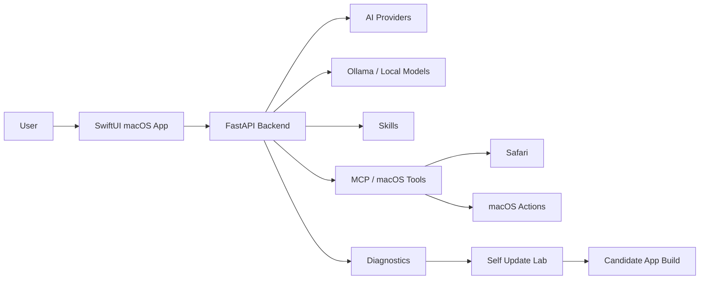

<div align="center">

# Mac Agent OS

### Experimental macOS AI Agent

#### Local-first • SwiftUI • FastAPI • Ollama • ChatGPT Bridge • MCP Tools • Skills • Self Update Lab


**A community experiment toward a powerful, free, self-evolving desktop AI agent for macOS.**

</div>

---

## What Is Mac Agent OS?

Mac Agent OS is an experimental **macOS AI agent** built with a native **SwiftUI desktop app** and a local **FastAPI Python backend**.

The project explores a desktop assistant that can connect to multiple AI providers, run local models through Ollama, use MCP-style tools, interact with macOS, diagnose itself, and safely build candidate updates.

It is not just a chatbot. The long-term goal is a practical desktop agent that can help with real workflows, local automation, coding tasks, diagnostics, and supervised self-improvement.

## Keywords

`macOS AI agent`, `SwiftUI AI app`, `FastAPI AI backend`, `Ollama desktop agent`, `local AI assistant`, `MCP tools`, `AI automation`, `desktop AI`, `ChatGPT bridge`, `Codex bridge`, `self-updating app`, `local-first AI`, `open source AI assistant`, `macOS automation`, `AI coding agent`.

## Current Status

This project is **experimental**. Expect bugs, incomplete features, and rough edges.

| Area | Status |
|---|---|
| Native macOS SwiftUI app | Working |
| Local FastAPI backend | Working |
| Bundled backend in `.app` | Working |
| Ollama / local models | Working |
| ChatGPT / Codex Bridge | Experimental |
| AI provider settings | Experimental |
| MCP / local tools | Experimental |
| Safari and macOS actions | Partial |
| Skills system | Experimental |
| Diagnostics and logs | Working |
| Self Update Lab | Experimental |
| English / French UI | Started |
| Autonomous coding | Early prototype |

## Features

- Native macOS desktop app using SwiftUI
- Local FastAPI backend
- Double-click `.app` mode with bundled backend
- Ollama support for local models
- ChatGPT / Codex Bridge provider mode
- OpenAI-compatible provider architecture
- Hugging Face router support
- Anthropic and Gemini provider structure
- MCP-style local tools
- Safari and macOS control actions
- Skills system inspired by Claude Skills
- Provider diagnostics
- Backend diagnostics
- Logs view
- Self Update Lab with safe, working, and candidate copies
- French and English interface option

## Vision

The goal is to build one of the most capable **free and community-driven macOS AI agents**:

- usable by normal users
- local-first where possible
- provider-independent
- extensible through skills and tools
- compatible with local models
- transparent about errors
- able to diagnose itself
- able to safely build candidate updates
- open to community experimentation

## Architecture



## AI Providers

Supported or planned provider modes:

- Ollama / local models
- ChatGPT / Codex Bridge
- OpenAI API
- Hugging Face router
- Anthropic
- Gemini
- Custom OpenAI-compatible endpoints

Ollama is optional. Cloud providers are optional. The project should remain usable without forcing a paid provider at launch.

Hugging Face may offer a free tier or credits depending on account and model, but it is not unlimited or guaranteed.

## Skills

Mac Agent OS includes a modular Skills system for desktop capabilities.

Initial skills include:

- Mac Control
- Safari Assistant
- Local Models
- Provider Doctor
- Code Helper
- Self Update Lab

The long-term goal is a reusable ecosystem of skills that can guide the agent, expose tools safely, and help with complex desktop tasks.

## Self Update Lab

The Self Update Lab is an experimental supervised self-improvement workflow.

It can:

- keep a safe copy of the project
- keep a working copy
- run diagnostics
- ask an AI provider for an update proposal
- build a candidate `.app`
- keep the safe copy untouched

This is not yet a fully autonomous self-modifying system. Candidate promotion and destructive actions should require explicit confirmation.

## Safety Principles

Mac Agent OS should be powerful, but not reckless.

- No destructive action without explicit confirmation
- No secrets in logs
- Local-first where possible
- Cloud providers optional
- Ollama optional
- Clear user-facing errors
- Safe copy before self-update experiments
- Candidate builds before promotion
- Human review for risky actions

## Development

Create the Python environment:

```bash
python3.12 -m venv .venv312
source .venv312/bin/activate
python -m pip install --upgrade pip
python -m pip install -r requirements.txt
```

Run the backend:

```bash
.venv312/bin/python server.py
```

Build the SwiftUI app:

```bash
CLANG_MODULE_CACHE_PATH=/private/tmp/macagent-clang-cache swift build --package-path "NativeMacApp"
```

Run tests:

```bash
PYTHONPYCACHEPREFIX=/private/tmp/macagent-pycache .venv312/bin/python -m py_compile server.py mcp_hub.py llm_universal.py provider_connections.py skills.py self_update.py
PYTHONPYCACHEPREFIX=/private/tmp/macagent-pycache .venv312/bin/python -m unittest discover -s tests
CLANG_MODULE_CACHE_PATH=/private/tmp/macagent-clang-cache swift build --package-path "NativeMacApp"
```

## Build Bundled App

Build the backend binary:

```bash
.venv312/bin/python -m pip install pyinstaller
.venv312/bin/pyinstaller --clean server.spec
```

Build the app bundle:

```bash
cd NativeMacApp
ENVIRONMENT=prod \
SIGN_IDENTITY='' \
CLANG_MODULE_CACHE_PATH=/private/tmp/macagent-clang-cache \
BACKEND_BINARY="../dist/MacAgentServer" \
zsh script/build_and_bundle.sh
```

The generated app is written under `/tmp/MacAgentOS-build/prod/`.

## Community Help Wanted

I am looking for contributors interested in:

- macOS / SwiftUI development
- Python / FastAPI backend work
- Ollama and local models
- OpenAI-compatible providers
- MCP tools
- autonomous agent workflows
- safe self-update systems
- UI/UX improvements
- security review
- packaging and notarization
- documentation
- testing and QA

## Good First Contributions

- Test the app on another Mac
- Improve README and setup docs
- Add screenshots or a demo video
- Improve English/French localization
- Add provider-specific tests
- Add safe MCP tools
- Improve timeout handling
- Improve local model prompts
- Review self-update safety
- Report confusing UX flows

## Before Publishing Your Fork

Do not commit:

- `.venv312/`
- `data/`
- `build/`
- `dist/`
- `.macagent/`
- app bundles
- personal provider settings
- API keys or tokens

Run a secret scan before pushing:

```bash
rg -n --hidden -i "sk-|sk-proj-|hf_|api[_-]?key|bearer|token|secret|password|client_secret|private_key" .
```

## Disclaimer

Mac Agent OS is experimental software. It may fail, hang, make mistakes, or require manual debugging.

Review actions before approving them, especially anything related to files, local tools, code generation, or self-update.

## License

License to be defined.

---

<div align="center">

### Help build the most powerful free and open macOS AI agent.

</div>
